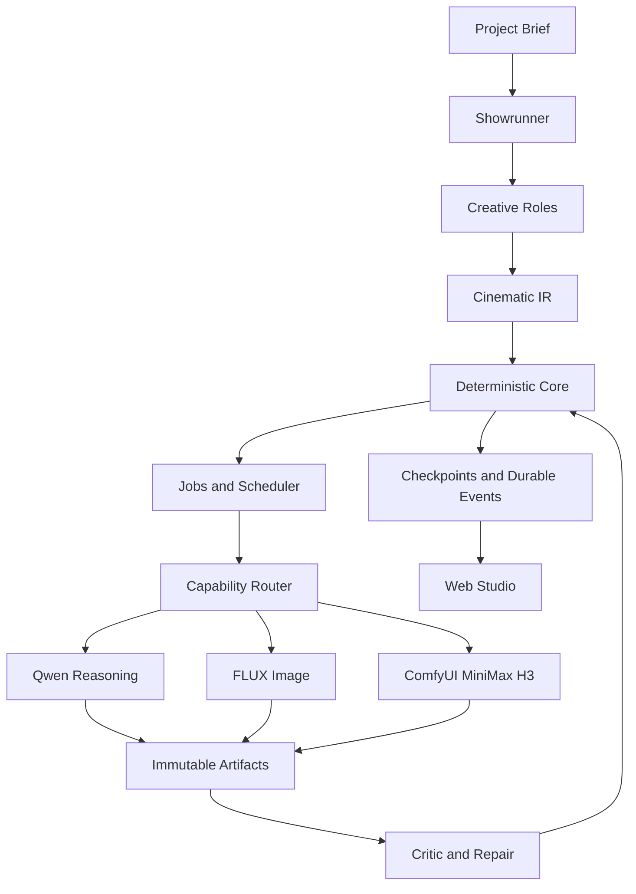

# VibeFilming

VibeFilming 是一套面向持续创作的 AI 电影生产系统。它把故事开发、剧本、镜头规划、首尾帧、视频、原生音频、质量检查、修复和成片组织为可恢复的生产流程，而不是把整部电影压缩成一次 Prompt 调用。

仓库中的 `movie_agent` 包仍以 Movie Agent Core 作为内部引擎名；产品、Agent 与 GitHub 项目统一使用 **VibeFilming**。

## 当前进度

截至 2026 年 9 月 7 日，项目已完成核心工作流、真实推理、Web Studio 和首条真实媒体链路。默认配置仍使用 Mock，真实模型必须显式启用，系统不会在真实 Provider 失败时静默回退。

| 模块 | 当前状态 | 已验证结果 |
| --- | --- | --- |
| 确定性生产核心 | 已完成 | 21 个生产节点、DAG 校验、人工门、任务、事件、检查点与恢复 |
| 角色推理 | 真实接入 | OpenAI 兼容端点上的 Qwen，六类创作角色输出经结构化校验后提交 |
| Web Studio | 已完成 | React 工作台、中英文界面、项目控制、SSE 事件、检查器、Artifact 预览 |
| 图像生成 | 真实接入 | FLUX.1-dev 已生成并保存 1024 x 576 首帧和尾帧 |
| ComfyUI 桥接 | 已完成 | 版本化 API Workflow、语义 Binding Manifest、编译器、HTTP WebSocket 客户端 |
| 视频与原生音频 | 定向真实验收通过 | MiniMax H3 FL2VA 生成 608 x 352、22 帧、24 fps 的 0.92 秒视频及原生音频，18 个执行节点全部成功 |
| 视觉审核与独立音频 | 尚未真实接入 | Vision VLM、TTS、音乐、音效、拟音仍使用 Mock |
| 后期与完整成片 | 尚未真实验收 | 当前真实链路证明单镜头媒体生产，完整多场景电影仍待联调 |

真实 H3 验收耗时 28.63 秒，视频和音频都写入不可变 Artifact，并进入 Timeline。检查点恢复保留既有输出，没有再次调用 Provider。对应证据保存在 `workspace/flux-agent-acceptance-20260907` 和 `workspace/h3-fl2va-acceptance-20260907`。

## 设计哲学

VibeFilming 采用“契约驱动、核心裁决、模型可插拔”的设计。核心原则可以概括为：

> 一切皆契约，模型皆可替换，状态归于核心。

### 创意归模型 事实归核心

LLM 负责故事、导演、分镜、表演、机位和局部创意决策。稳定 ID、工作流拓扑、连续性、已提交的 Story Bible 事实、版本、重试预算和最终状态由确定性 Core 管理。已经成为 canonical fact 的内容由 Core 直接注入下游，不要求模型重新复述再做字符串比对。

### 类型化契约代替自然语言状态

角色之间通过 Cinematic IR 和 Pydantic 类型交接结果。自然语言可以用于创作，但不作为系统唯一状态。模型输出先进入 Draft，经解析、映射和语义校验后，才由 Showrunner 提交为 canonical Project、Scene、Shot 或 Artifact。

### 模型是边界适配器

Qwen、FLUX、MiniMax H3 和 ComfyUI 都位于 Provider 边界。Cinematic IR 不保存服务地址、模型节点 ID 或厂商字段。更换模型时优先替换 Provider、Workflow Template 与 Binding Manifest，不改写领域对象和生产逻辑。

### 电影制作是可恢复状态机

生产过程由显式 DAG、Generation Job、Durable Event、Checkpoint、Human Gate 和有限 Retry Budget 共同描述。暂停、失败和重启后，系统从已提交状态继续，成功阶段不会被无意义地重复推理。

### Artifact 是生产事实

生成结果不是临时文件。每个 Artifact 都有稳定 ID、不可变版本、父子关系、Provider、模型、Prompt、Seed、输入哈希、评估和修复来源。新版本追加保存，旧版本不会被覆盖。

### 失败进入检查和修复闭环

系统按“生成、技术检查、视觉语义检查、电影性检查、问题分类、定向修复”推进。失败会形成结构化证据；预算耗尽后进入人工审核或导演重规划，而不是无限重抽和消耗算力。

### 两层图保持产品语义清晰

Web Studio 的上层 Production Graph 展示电影生产阶段；下层 Provider Execution Graph 展示可展开的 ComfyUI 执行子图。ComfyUI 节点只存在于适配和观测层，不会污染电影领域模型。

## 系统架构



依赖方向始终指向内部契约。Domain 不依赖 FastAPI、React、模型 SDK、GPU 运行时或具体编排框架；本地实现可以在保持状态语义、幂等和事件契约的前提下替换为队列、数据库或远程执行器。

## 生产流程

```text
故事简报
-> 创意扩展与故事规划
-> 剧本和 Story Visual Bible
-> Scene 与 Shot 规划
-> 人工审核
-> FLUX 首尾帧
-> ComfyUI MiniMax H3 视频与原生音频
-> 技术和语义审核
-> 定向修复
-> Timeline 与后期
-> 最终审核和成片
```

## 技术栈

- 后端：Python 3.12、FastAPI、Pydantic v2、HTTPX、WebSocket、SSE
- 前端：React 19、TypeScript、Vite、TanStack Query、React Flow、Dagre
- 推理：OpenAI 兼容 Qwen 服务、FLUX.1-dev、ComfyUI、MiniMax H3 FL2VA
- 可靠性：类型化契约、幂等任务、追加式 Artifact、原子检查点、可重放事件
- 验证：pytest、Vitest、Playwright，以及显式开启的真实模型验收

## 仓库结构

- `movie_agent/domain`：版本化领域契约与稳定枚举
- `movie_agent/cinematic`：连续性、首尾帧、策略与 Prompt 编译边界
- `movie_agent/orchestration`：Showrunner、角色运行时与人工审核
- `movie_agent/execution`：任务、调度、事件和检查点
- `movie_agent/providers`：Qwen、FLUX、ComfyUI 与 Mock Provider
- `movie_agent/comfyui`：Workflow Template、Binding、编译器和客户端
- `movie_agent/artifacts`：不可变 Artifact 与 provenance
- `movie_agent/quality`：技术检查、Critic 与有限修复策略
- `movie_agent/media`：媒体契约、存储、预览、Timeline 与执行子图
- `movie_agent/api`：FastAPI 应用和 Studio 读模型
- `web`：VibeFilming Web Studio
- `docs`：架构、契约、运行时和验收记录
- `tests`：核心、Provider、API、前端与浏览器测试

## 本地运行

### 安装后端

```powershell
python -m venv .venv312
.\.venv312\Scripts\python.exe -m pip install -e ".[dev]"
Copy-Item .env.example .env
```

`.env` 可能包含服务凭据，不要提交到 Git。

### 启动后端和 Web Studio

```powershell
.\.venv312\Scripts\python.exe -m uvicorn movie_agent.api.app:create_app --factory --host 127.0.0.1 --port 8080 --workers 1
```

在第二个终端运行：

```powershell
Set-Location web
npm ci
npm run dev
```

打开 `http://127.0.0.1:5173`。当前本地任务、资源锁和命令仲裁是进程内实现，因此后端应使用一个 worker。

### 显式启用真实媒体 Provider

```powershell
$env:MOVIE_AGENT_IMAGE_PROVIDER='flux_direct'
$env:MOVIE_AGENT_FLUX_ENDPOINT='http://127.0.0.1:9001'
$env:MOVIE_AGENT_VIDEO_PROVIDER='comfyui'
$env:MOVIE_AGENT_COMFYUI_ENDPOINT='http://127.0.0.1:8188'
$env:MOVIE_AGENT_COMFYUI_WORKFLOW_PROFILE='minimax_h3_fl2va'
```

真实 Provider 依赖外部已启动的 Qwen、FLUX 和 ComfyUI 服务。仓库不会下载模型，也不会替用户启动 GPU 服务。普通测试不会调用真实模型；真实验收必须通过专用环境变量显式授权。

## 验证

```powershell
.\.venv312\Scripts\python.exe -m pytest -q
Set-Location web
npm test
npm run build
npm run test:e2e
```

定向真实验收入口：

- `tests/test_p2a_integration.py`：真实 Qwen 角色推理
- `tests/test_flux_agent_integration.py`：真实 FLUX 首尾帧与 Agent 链路
- `scripts/accept_comfyui_h3.py`：真实 H3 视频与原生音频
- `web/e2e/h3-preview.spec.ts`：既有 H3 Artifact、播放和 18 节点执行子图

## 团队分工

- 施俊宇：负责 VibeFilming Agent 架构、类型化契约、生产核心、模型 Provider 接入及真实链路验收，重点完成 Qwen、FLUX、ComfyUI 与 MiniMax H3 的集成。
- 孙善斌：负责剧本设计、编辑和团队共用报告材料。
- 张天宇：负责剧本灵感来源、内容讨论与修改。

## 已知限制和下一步

- 完成当前 Scene 规划中的 canonical fact ownership 修复，避免下游模型重复生成不可变事实。
- 用真实多场景项目完成从剧本到最终成片的一次完整验收；当前 H3 结论属于单镜头定向验收。
- 接入真实 Vision VLM Critic、TTS、音乐、音效、拟音和 Post Provider。
- 增加角色一致性、风格持续性和 LoRA 能力；当前 FLUX Provider 会明确拒绝 LoRA，而不是忽略参数。
- 完善 GPU 服务生命周期与资源调度，减少 Qwen、FLUX 和 H3 同时驻留的内存压力。
- 补齐认证、多用户隔离、公共部署和生产级持久队列。

## 进一步阅读

- [系统架构](docs/architecture.md)
- [Cinematic IR](docs/cinematic_ir.md)
- [工作流与恢复](docs/workflow.md)
- [角色运行时](docs/role_runtime.md)
- [Web Studio](docs/p2b_frontend.md)
- [媒体运行时](docs/p3_media_runtime.md)
- [FLUX Agent 验收](docs/flux_agent_acceptance.md)
- [ComfyUI 接入方案](docs/comfyui_video_integration_plan.md)
