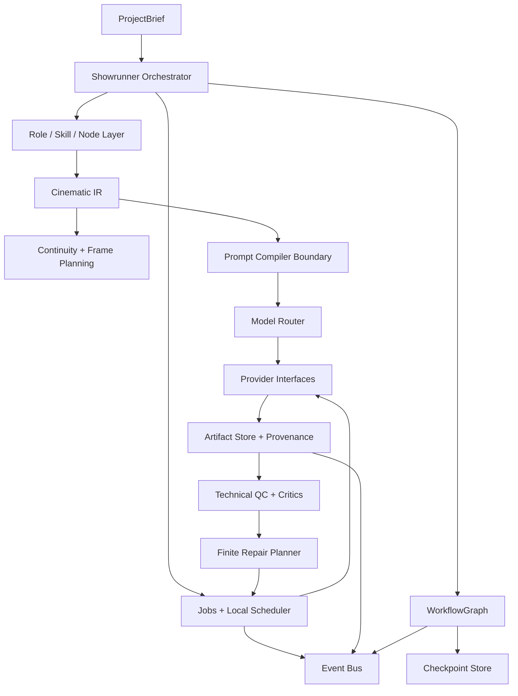
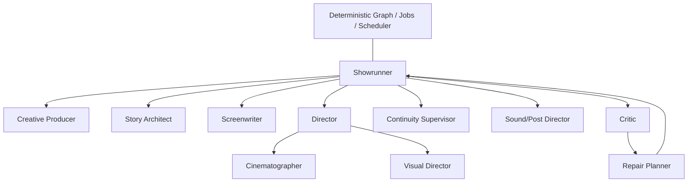
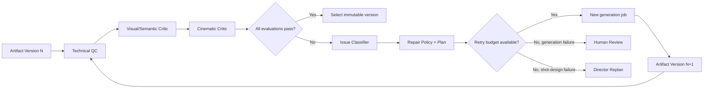
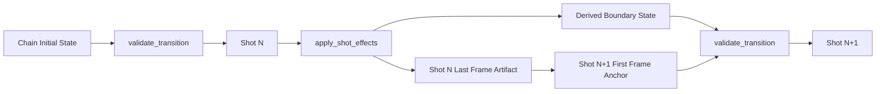
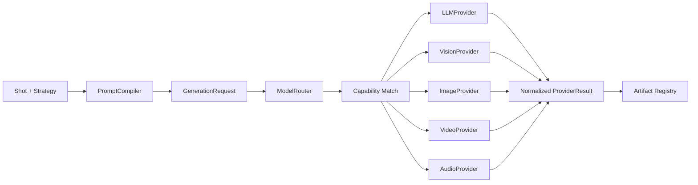
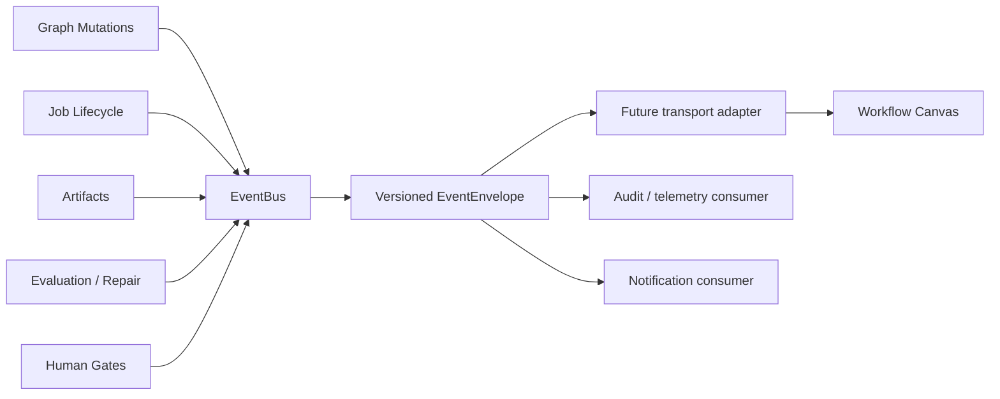

# Movie Agent Core Architecture

## Decision summary

Movie Agent Core is a Python 3.12 and Pydantic v2 domain framework. It deliberately contains no model SDK, HTTP server, frontend, GPU runtime, or deployment assumption. The central design is one Showrunner coordinating role-labelled workflow nodes while deterministic code owns graph validation, continuity, scheduling, retries, artifacts, checkpoints, and events.

The domain does not depend on an orchestration engine. `WorkflowGraph` is the durable contract; `ProductionGraph` is the current local adapter. A future LangGraph, queue, database, or remote provider adapter must translate at the boundary instead of replacing the domain types.

## 1. System Architecture

Dependencies point inward: domain contracts have no dependency on orchestration, execution, storage, providers, or UI. Cinematic algorithms depend only on domain contracts. Local infrastructure implements replaceable interfaces.

## 2. Agent Role Architecture

Roles are `RoleSpec` descriptors and workflow responsibilities, not independently deployed conversational agents. A role can later be implemented by a skill, local function, subgraph, or provider call. Provider choice remains outside the role contract.

## 3. Production DAG

The standard flow is data, not an executor-owned array: nodes and typed edges are validated for unique IDs, valid references, and acyclicity. Edge vocabulary includes dependency, condition, success, failure, repair, and human gate.

## 4. Critic / Repair Loop

Evaluation is structured evidence, not a Boolean. Repair actions route from issue types and always respect the shot retry budget. Old artifact versions remain immutable.

## 5. Continuity Chain

Character, prop, location, and global scene state are checked before a provider request exists. The scheduler also serializes jobs sharing a continuity chain; unrelated chains can use available capacity concurrently.

## 6. Provider Abstraction

Routing considers task, quality profile, required capabilities, strategy, and logical resource class. Provider adapters normalize failure type and retryability. No provider name or endpoint appears in Cinematic IR.

## 7. Event to Future Workflow Canvas

The local event bus provides an ordered in-memory stream. A future frontend should subscribe through a transport adapter and project node, edge, job, artifact, evaluation, repair, and review events into its own view state. UI coordinates and CSS do not belong in the backend node contract.

## Deterministic execution

`GenerationJob` owns lifecycle, stable identity, dependencies, priority, resource class, bounded retry, cancellation, timestamps, and resulting artifact IDs. `LocalJobScheduler` waits for DAG dependencies, uses weighted logical capacity, and locks each continuity chain. `LocalJobExecutor` retries only normalized retryable failures and stops at the persisted budget.

The local implementation is intentionally small but its boundaries permit a durable queue later. A replacement must preserve job transition semantics, idempotency, event emission, cancellation, and retry counts.

## Durability and explainability

`LocalArtifactStore` uses stable artifact IDs and append-only versions. Files are stored at versioned URIs and never overwritten. Selection changes registry metadata, not content. Provenance records the responsible role, tool, provider, prompt package, inputs, strategy, parameters, evaluations, and repair plans.

After each completed workflow node, `LocalCheckpointStore` atomically saves graph state, project state, completed nodes, jobs, artifact records, evaluations, repair plans, and retry counters. Resume requeues interrupted active jobs, preserves terminal records, restores unresolved human reviews, and skips completed nodes.

## State separation

- Canonical Project State contains confirmed production facts and completed workflow state.
- Creative Memory contains preferences, rejected choices, and role notes.
- Generation History records strategy/provider outcomes and issue codes.

No vector database is required for these contracts. Retrieval or embedding can be added later as an adapter over stable IDs.

## Deferred by design

This phase does not include Spark/DGX integration, model downloads, ModelScope, ComfyUI, vLLM, a formal server deployment, React, authentication, or real media generation. None is needed to execute and verify the mock film pipeline.
